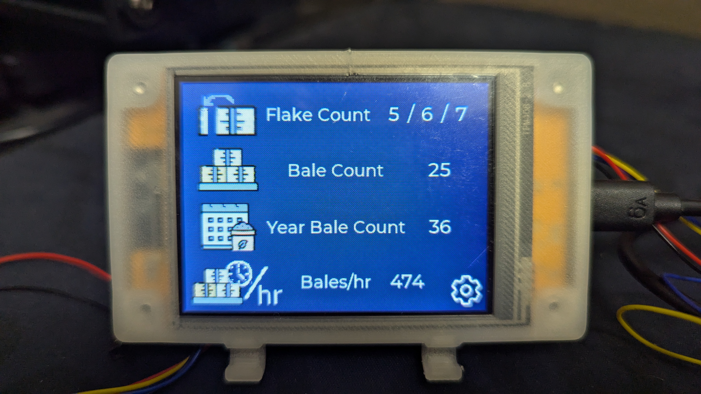
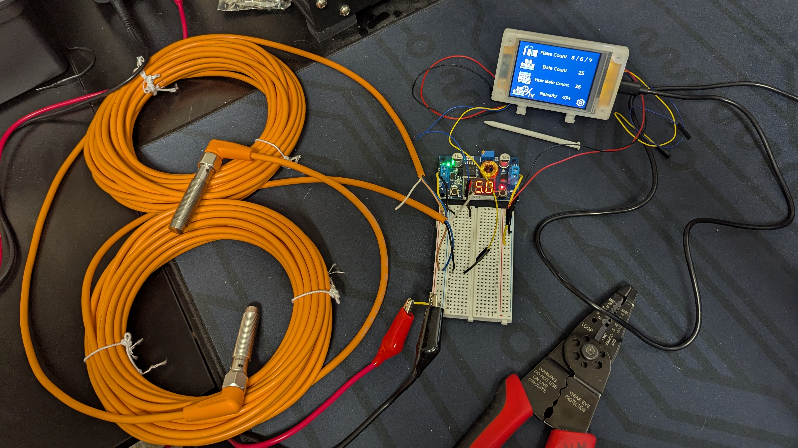
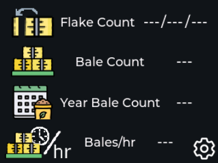
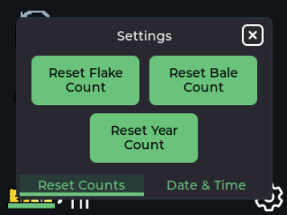
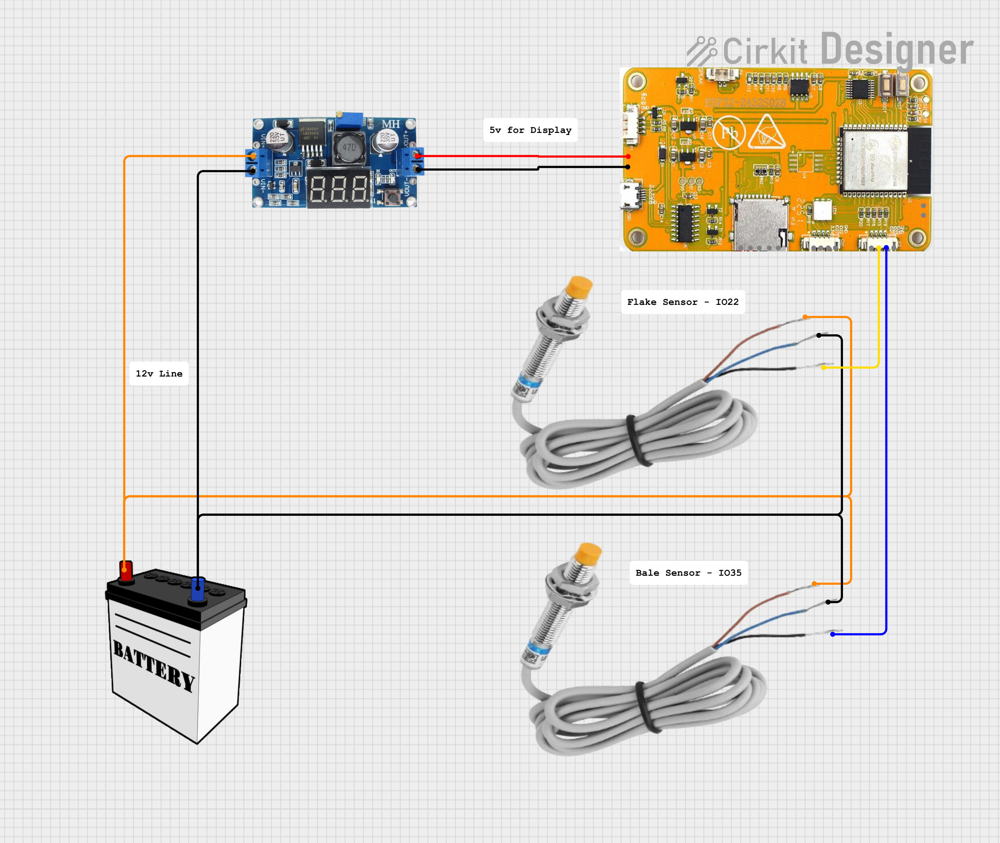
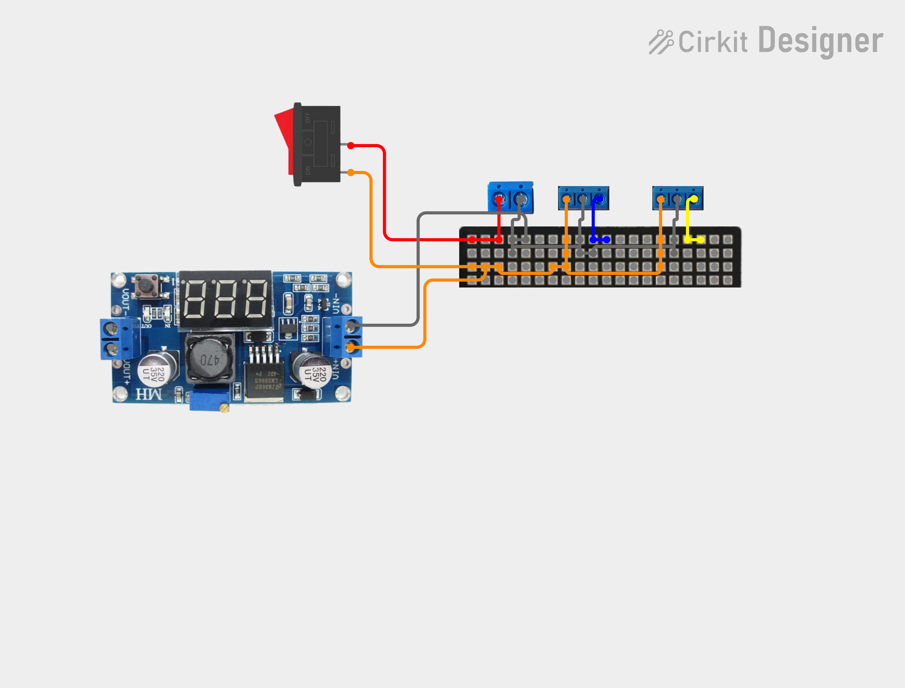

# BaleCounter

A bale counting system for ESP32 CYD, touchscreen display, designed for tracking hay bales and flakes with real-time rate calculations.

## Project Images

<!-- Add your project photos here -->


*Complete BaleCounter system installed*



*BaleCounter in operation*

## User Interface

<!-- Add UI screenshots here -->


*Main counting interface showing bale count, yearly count, flake counts, and bales per hour*



*Settings panel for resetting counters*

## Wiring Diagram

<!-- Add wiring diagram here -->


*Complete wiring schematic showing connections between sensors, power supply, and ESP32*



*Wiring schematic showing how the PCB is laid out*

## Features

- **Bale Counting**: Track total bales processed
- **Yearly Bale Count**: Separate counter for yearly totals
- **Flake Counting**: Count flakes within each bale, with history of previous 2 bales
- **Bales Per Hour**: Real-time calculation of processing rate
- **Persistent Storage**: All counts are saved to non-volatile memory
- **Touch Interface**: Easy-to-use touchscreen controls
- **Sensor Integration**: Automatic counting via GPIO sensors

## Bales Per Hour Calculation

The system calculates bales per hour using a session-based approach:

### How It Works

1. **Session Start**: When the first bale of a session is detected, the system records the timestamp but displays "0" (since you need at least 2 bales to calculate a rate).

2. **Rate Calculation**: Starting with the second bale, the system calculates the rate using:
   ```
   Rate = (Number of bales - 1) / Elapsed time in hours
   ```
   
3. **Why "Number of bales - 1"?**: The calculation uses intervals between bales. For example:
   - 2 bales = 1 interval between them
   - 3 bales = 2 intervals between them
   - This gives a more accurate rate based on actual processing time

4. **Time Tracking**: 
   - `first_bale_time`: Timestamp when the first bale of the session was detected
   - `last_bale_time`: Timestamp when the most recent bale was detected
   - Elapsed time = `last_bale_time - first_bale_time`

5. **Display Format**:
   - Shows "0" when no rate can be calculated (0 or 1 bale)
   - Shows one decimal place for rates under 10.0 (e.g., "8.5")
   - Shows whole numbers for rates 10.0 and above (e.g., "15")

### Session Reset

The bales per hour session resets when:
- The bale count is reset via the UI
- The system is restarted
- The `resetBalesPerHourSession()` function is called

This ensures that the rate calculation reflects the current working session rather than historical data.

### Example

If you process 5 bales in 30 minutes:
- Number of intervals: 5 - 1 = 4
- Elapsed time: 0.5 hours
- Rate: 4 / 0.5 = 8.0 bales per hour

## Hardware

### Main Components

- **ESP32-2432S028R** (Cheap Yellow Display - CYD)
  - 2.8" TFT LCD with resistive touch
  - Built-in ESP32 microcontroller
  - GPIO pins for sensor inputs

### Sensors

- **Bale Sensor** (GPIO 35): **DW-AS-711-M12**
  - Contrinex inductive proximity sensor
  - Tubular, 12mm diameter x 60mm body
  - Stainless steel housing
  - NPN, N.O. output
  - 10mm sensing distance, non-flush
  - 400 Hz switching frequency
  - IP68 IP69K rated
  - 4-pin M12 quick-disconnect

- **Flake Sensor** (GPIO 22): **DW-AS-711-M12**
  - Same specifications as bale sensor
  - Used for counting flakes within each bale

### Power Supply

- **Input**: 12V from tractor battery
- **Buck Converter**: HiLetgo 5A 75W DC-DC Step Down Power Module XL4015
  - Input Voltage: 4.0~38V
  - Output Power: 75W
  - 5A high-efficiency step-down with low ripple
  - Overheat protection and short circuit protection
  - Built-in LED power indicator
  - Integrated voltmeter with self-calibration
  - Adjustable output (set to 5V for ESP32)

### Wiring

- GPIO 35: Bale sensor input (active LOW with pull-up)
- GPIO 22: Flake sensor input (active LOW with pull-up)
- Power: 5V from buck converter to ESP32 CYD
- Ground: Common ground between all components

## Software Features

- Built with PlatformIO
- LVGL for UI framework
- SquareLine Studio for UI design
- Non-volatile storage for persistence across reboots

## Image Directory Structure

To add images to this README, create an `images/` directory in the project root and add your photos:

```
BaleCounter/
├── images/
│   ├── project_overview.png      # Complete installed system
│   ├── project_in_use.png        # System in operation
│   ├── ui_main_screen.png        # Main UI interface
│   ├── ui_settings_screen.png    # Settings panel
│   └── wiring_diagram.png        # Complete wiring schematic
├── src/
├── platformio.ini
└── README.md
```

Replace the placeholder image references above with your actual photos once added.
